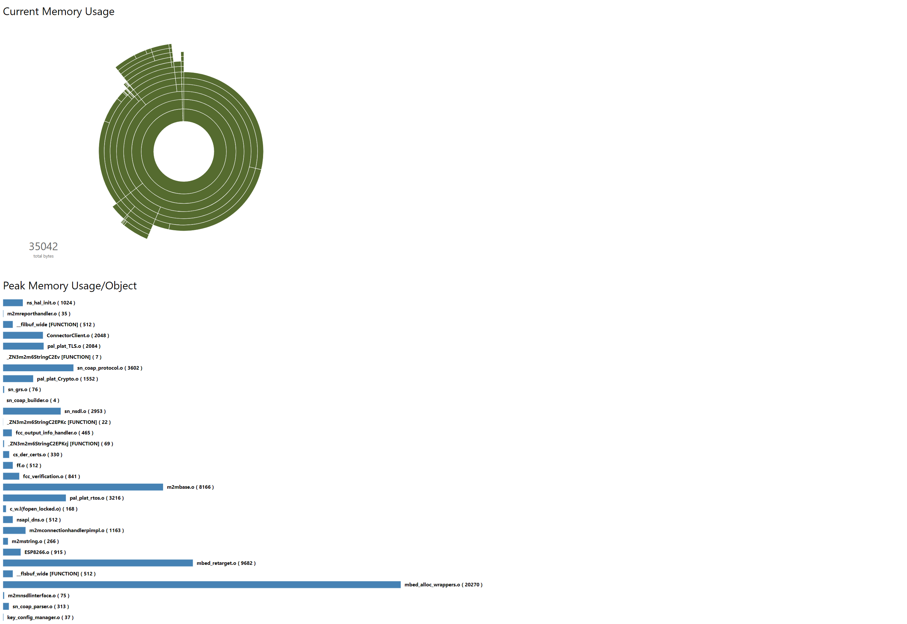

## Runtime Memory Trace Analysis
This post-processing tool can be used to parse memory tracing logs to generate runtime memory information. 

## Installation
Install `arm-none-eabi-gcc` and add to your path. This will install `arm-none-eabi-nm`.    
The analysis tool require the executable `arm-none-eabi-nm` to be present in your environemntal PATH.  

Then clone the tool to a local directory   
```bash
git clone https://github.com/ARMmbed/mbed-os-mem-report
```

## Capturing mem-trace logs
Collect the memory tracing logs by following the steps in the link below.   
https://os.mbed.com/docs/v5.7/tutorials/optimizing.html#runtime-memory-tracing

Memory trace logs will have entries as below for each memory operation, viz:malloc, calloc, realloc, free.   
Example of entries in a memory trace are as below.   

#m:2000a918;00022d4b-5   
#m:2000a930;000267cb-28   
#m:2000a118;0001ece7-1   
#m:2000a958;0001ece7-1   
#m:2000a968;00023117-16   
#m:2000a988;00023147-28   
#m:2000a9b0;00023163-16   
#f:00000000;0001ed67-2000a958   
#m:2000a958;0002678b-4   
#f:00000000;0001ed67-2000a118   
#m:2000a118;0001ed3f-1   
#m:2000a9d0;0001ed3f-1   
#m:2000a9e0;00006295-2   
#f:00000000;000062ad-2000a118   
#r:2000a9e0;0001ebd1-2000a118;2   
#m:2000a118;00006295-2   
#f:00000000;000062ad-2000a9d0   
#r:2000a118;0001ebd1-2000a9d0;2   
#m:2000a9f0;00022d4b-7   
#m:2000aa08;000267cb-44   
#m:2000aa40;00023117-16   
#m:2000aa60;00023147-28   
#m:2000aa88;00023163-16   
#m:2000a9d0;000231a3-2   
#m:2000aaa8;000231f7-2   
#m:2000aab8;0002678b-4   
#f:00000000;000165e3-00000000   
#m:2000aac8;00022e0b-2   
#f:00000000;0001ed67-2000a118   
#f:00000000;0001ed67-2000a9e0   

## Running the Analysis   
Once the memory trace logs are collected run the memreport.py tool as below.   
.\memreport.py -e <Path to .elf file> -m <Path to .map file> -i <Path to memory tracing capture file>   
For example:   
.\memreport.py -e C:\github\my-test-app\BUILD\k64f\arm\my-test-app.elf -m C:\github\my-test-app\BUILD\k64f\arm\my-test-app.map -i C:\logs\memory-tracing.log   

## Example Output
Below you can find an example report generated by the tool.   


## Interpreting the graphical report
The report contains 2 sections - **Current Memory Usage** and **Peak Memory Usage/Object**.   

**Current Memory Usage** provides an interactive pie chart providing the current memory usage information of the system based on memory tracing logs.    
You can hover your mouse on top of each sector to get a banner on top which indicates the module/object file/function using the piece of memory being highlighted.   

**Peak Memory Usage/Object** provides a peak memory usage of each object file based on memory tracing logs.    
Note that in the case where the tool is not able to find the exact symbol in the map file the function name itself will be used to represent the memory usage.   


